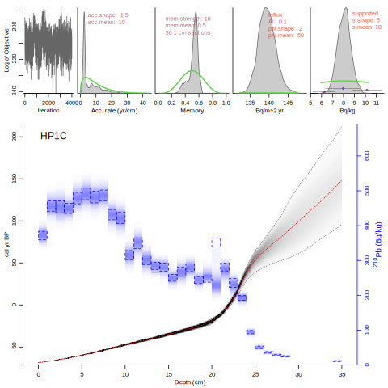

*rplum* produces Bayesian age-depth models from sediment cores dated with Pb-210 (Aquino et al. 2018). 

In short, like the commonly used CRS or constant-flux model, *Plum* (Aquino-López et al. 2018[^1]) assumes a constant rate of supply of unsupported Pb-210 (flux), and also either assumes a constant supported Pb-210 or estimates the supported levels from measurements of other isotopes. Both parameters are constrained by prior information on the flux and the supported Pb-210 (both are gamma distributions, which ensure that the values are always positive). It uses the Bacon (Blaauw and Christen 2011[^2]) age-model approach (piece-wise linear interpolation of sections of equal thickness (default 1 cm), constrained by prior information on accumulation rate and its variability) to assign ages to each depth, using millions of Markov chain Monte Carlo (MCMC) iterations. The output includes an age-depth model and posterior estimates for the flux, the supported Pb-210, the accumulation rate and its variability.

If the R package isn't installed yet on your computer (or if you wish to update it), install it like this:

```{r, eval=FALSE}
install.packages("rplum")
```

To load it, type:

```{r}
library(rplum)
```


To get started, run *Plum* like this (using the default core, accepting all options, going for a short and fast run, and storing the results in a temporary directory):

```{r, eval=FALSE}
Plum(ask=FALSE, suggest=FALSE, ssize=100, coredir=tempdir())
```

When asked, provide the date when the samples were measured (2018), accept the suggested tail measurements to estimate supported Pb (n.supp = 3), and set ra.case to 0 (no radium present; see below).

This produces an age-depth model for HP1C (Aquino-Lopez et al. 2018[^1]), the core that ships with *rplum*, and should hopefully look like the following graph:


The top panels show, from left to right, the MCMC series (this should show white noise, without much noticable structure), and the prior (green) and posterior (grey) distributions for, respectively, the accumulation rate (in yr/cm), the accumulation variability or memory, the flux of Pb-210 (phi), and the level of supported Pb-210 (s). Red text indicates the settings. (these panels are very important in order to assess the quality of the run and to allow for others to reproduce it, so please **don't cut them from your plots in your papers!**). Then finally, in the main panel below we have the age-depth model. Blue-scale indicates the modelled Pb-210 values (based on the posterior values for the age-model and the Pb-210 parameters), blue boxes indicate the measured values, grey-scale is the age-depth model, grey dashes are the 95% range, and red dashes are the mean age-depth model. 

This core has no accompanying measurements to estimate the level of supported Pb-210, so instead it models supported Pb-210 as constant. The parameters for supported and unsupported 210Pb are then estimated from the data (especially the tail-end, bottom-most data points), constrained by the prior information. That is radon case 0.

If you don't specify a core directory (`coredir=c()`), then Plum will look for a folder called Plum_runs in the directory where it is currently working. If no such folder is found, Plum will ask if it can make one. Make a note of where this folder is, as this is where Plum will expect to find other cores, including yours. 

Now we take a closer look at the structure of the data file of core HP1C. 
```{r}
dat <- read.csv(system.file("extdata/Cores/HP1C/HP1C.csv", package="rplum"))
head(dat)
```

The file is divided into a range of columns (separated by commas), from left to right: 

1. lab ID
2. bottom depth (i.e., not midpoints)
3. sample density (g / cm3)
4. means of the 210Pb measurements
5. their lab errors (1 standard deviation)
6. sample thickness

When making your own files, use the format above and save your .csv file the exact same name as the folder, within the Plum_runs folder. E.g., if your core is called MyCore, the file should be stored as `Plum_runs\MyCore\MyCore.csv`. Then run, specifying the date that your samples were measured, e.g. if this was in June 2014: 

```{r, eval=FALSE}
Plum("MyCore", sample.date=2014.5)
```

The default is to use the units Bq/kg for the Pb210 measurements. If yours are in dpm/g instead, use `Bqkg=FALSE`.

If radon measurements are available as estimates of supported Pb-210, these can be added as additional columns (mean, error) in the .csv file, after the columns for Pb-210. 

After the data columns of the .csv file, you can optionally add 3 lines of additional information (each row again separated by a comma):

1. the date when the samples were measured (e.g., March 2014 = 2014.25)
2. the number of bottom samples to be used for estimating the supported Pb-210 (minimum 3)
3. how to treat radon measurements:
    0. no radon measured
    1. assume constant radon (i.e. use the measurements to inform us about the mean supported Pb-210 throughout the core), or 
    2. assume varying radon values throughout the core

Alternatively, this information can be provided within the Plum command, e.g., as `Plum(date.sample=2014.25, n.supp=4, ra.case=2)`, and Plum will also ask this if it encounters radon in your core's file.

It is not possible to both assume varying radon and select bottom samples for estimating radon, as the latter assumes constant radon whereas the former assumes it is varying. 
  
If your core also has other dates, e.g., radiocarbon, that's not a problem. Just use a file with the same formatting as that of rbacon (Blaauw and Christen 2011[^2]), save it in the directory of the core, and provide its name as an option, e.g.:

```{r, eval=FALSE}
Plum("MyCore", otherdates="MyCore_C14.csv")
```

Much of the rest of the `rplum` package functions the same as `rbacon` (check its vignettes [here](https://cran.r-project.org/package=rbacon)).

rplum is open-source software; you are free to use, copy, distribute and modify it, but please do read this tutorial, the help functions and accompanying paper before using the program. This software is distributed under the terms of the GNU General Public Licence. rplum does not come with any warranty and the authors do not assume any responsibility for the usefulness of any portion of this program. *Do cite this program when modifying or using it, including its version, applied settings and calibration curves used.*

Parts of this software remain under construction. Details such as the default settings and behaviour could change between versions, so please check this manual for the latest information. You are most welcome to report bugs, ideas and missing features to Maarten <maarten.blaauw@qub.ac.uk>, Marco <aquino@cimat.mx> or Andrés <jac@cimat.mx>.

---

**References**

[^1]: Aquino-Lopez, M.A., Blaauw, M., Christen, J.A., Sanderson, N., 2018. Bayesian analysis of 210Pb dating. Journal of Agricultural, Biological, and Environmental Statistics 23, 317-333

[^2]: Blaauw, M. and Christen, J.A., 2011. Flexible paleoclimate age-depth models using an autoregressive gamma process. Bayesian Analysis 6(3), 457-474
